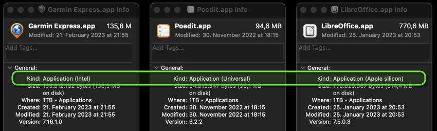

# macOS

Watch out! Not all apps are optimized for the Apple Silicon CPU!




## Homebrew

Website: <https://brew.sh/>

Install the missing package manager for macOS:

```shell
/bin/bash -c "$(curl -fsSL https://raw.githubusercontent.com/Homebrew/install/HEAD/install.sh)"
```

### Packages

```shell
brew install curl wget
brew install htop
brew install git
brew install nano sqlite jq shellcheck flake8
brew install ansible terraform
brew install imagemagick jhead
# Perl
brew install perl
PERL_MM_OPT="INSTALL_BASE=$HOME/perl5" cpan local::lib
```


## Applications

### KeePassXC

Website: <https://keepassxc.org/download/#mac>

### Spotify

Website: <https://www.spotify.com/de/download/mac/>

### Firefox

Website: <https://www.mozilla.org/en-US/firefox/new/>

#### Deutsch

German Dictionary: <https://addons.mozilla.org/en-US/firefox/addon/dictionary-german/>

### Chrome

Website: <https://www.google.com/chrome/>

### Visual Studio Code

Website: <https://code.visualstudio.com/docs/setup/mac>

Download: <https://code.visualstudio.com/Download>

#### Launching from the command line

You can also run VS Code from the terminal by typing 'code' after adding it to the path:

1. Launch VS Code.
1. Open the Command Palette (ç+<kbd>Shift</kbd>+<kbd>P</kbd>) and type `shell command` to find the Shell Command: Install 'code' command in PATH command.

#### Setting

Open Settings (<kbd>Cmd</kbd>+<kbd>,</kbd>) and copy JSON settings: [vscode.json](vscode.json)

### LibreOffice

Website: <https://www.libreoffice.org/download/download-libreoffice/>

### Adobe Acrobat Reader

Website: <https://www.adobe.com/acrobat/pdf-reader.html>

### Google Cloud CLI

Website: <https://cloud.google.com/sdk/docs/install>

```shell
brew install --cask google-cloud-sdk
```

### DB Browser for SQLite

Website: <https://sqlitebrowser.org/dl/>

```shell
brew install --cask db-browser-for-sqlite
```

### Sourcetree

Website: <https://www.sourcetreeapp.com/>

### Audacity

Website: <https://www.audacityteam.org/download/mac/>

### Elgato Control Center

Website: <https://www.elgato.com/en/downloads>

### Geekbench 6

Website: <https://www.geekbench.com/download/>

### OBS

Website: <https://obsproject.com/>

### VLC

Website: <https://www.videolan.org/vlc/>

### Shotcut

Website: <https://www.shotcut.org/download/>

### Poedit

Website: <https://poedit.net/download>

### qFlipper

Website: <https://flipperzero.one/update>

### QMK Toolbox

Website: <https://docs.qmk.fm/#/>

Download: <https://github.com/qmk/qmk_toolbox/releases/latest>

### Inkscape

macOS Ventura (13): ❌ not supported

Website: <https://inkscape.org/en/release/>

### GoldenCheetah

Apple Silicon: ❌

Website: <http://www.goldencheetah.org/#section-download>

### Garmin Express

Apple Silicon: ❌

Website: <https://www.garmin.com/en-US/software/express/mac/>

### Google Earth Pro

Apple Silicon: ❌

Website: <https://www.google.com/earth/versions/#download-pro>

### Logitech G HUB

Apple Silicon: ❌

Website: <https://support.logi.com/hc/en-us/articles/360036533533-Download-Stub-G403>

Download: <https://download01.logi.com/web/ftp/pub/techsupport/gaming/lghub_installer.zip>


## App Store

### Xcode

Link: <https://apps.apple.com/de/app/xcode/id497799835?l=en&mt=12>

#### FileMerge

FileMerge (opendiff) is bundled with Xcode. Copy it to Applications folder:

```shell
cp -r /Applications/Xcode.app/Contents/Applications/FileMerge.app /Applications/
```
### Commander One PRO

Link: <https://apps.apple.com/de/app/commander-one-pro-ftp-client/id1035237815?l=en&mt=12>

### The Unarchiver

Link: <https://apps.apple.com/de/app/the-unarchiver/id425424353?l=en&mt=12>

### Greenshot

Link: <https://apps.apple.com/de/app/greenshot/id1103915944?l=en&mt=12>

### dict.cc plus

Link: <https://apps.apple.com/de/app/dict-cc-dictionary/id521791825?l=en>


## Themes

### Source Code Pro

Website: <https://adobe-fonts.github.io/source-code-pro/>

Download TTF: <https://github.com/adobe-fonts/source-code-pro/releases/latest>

Install: `SourceCodePro-Medium.ttf`

### Dracula

* Terminal: <https://draculatheme.com/terminal>
    * Download: <https://github.com/dracula/terminal-app/archive/master.zip>
* Visual Studio Code:
    1. Go to View -> Command Palette or press <kbd>Cmd</kbd>+<kbd>Shift</kbd>+<kbd>P</kbd>
    1. Then enter Install Extension
    1. Write `Dracula Official`
    1. Select it or press <kbd>Enter</kbd> to install


## Hardware

### MOTU M2

Website: <https://motu.com/en-us/products/m-series/m2/getting-started/>

No extra drivers needed!

### EPSON WF-3820 Series

Website: <https://support.epson.net/setupnavi/?LG2=EN&OSC=MI&MKN=WF-3820&PINF=menu&linkflg=alllist>

Download: <https://download.ebz.epson.net/dsc/du/02/DriverDownloadInfo.do?LG2=EN&CN2=US&CTI=59&PRN=WF-3820%20Series&OSC=MI&DL>


## Hypervisor Virtualization

### UTM Virtual Machines

Website: <https://mac.getutm.app/>

Link: <https://apps.apple.com/de/app/utm-virtual-machines/id1538878817?l=en&mt=12>

### Parallels Desktop

Download: <https://www.parallels.com/de/products/desktop/trial/>

### Images

#### Ubuntu

Download: <https://ubuntu.com/download/server/arm>

##### Rocky

Download: <https://rockylinux.org/download>