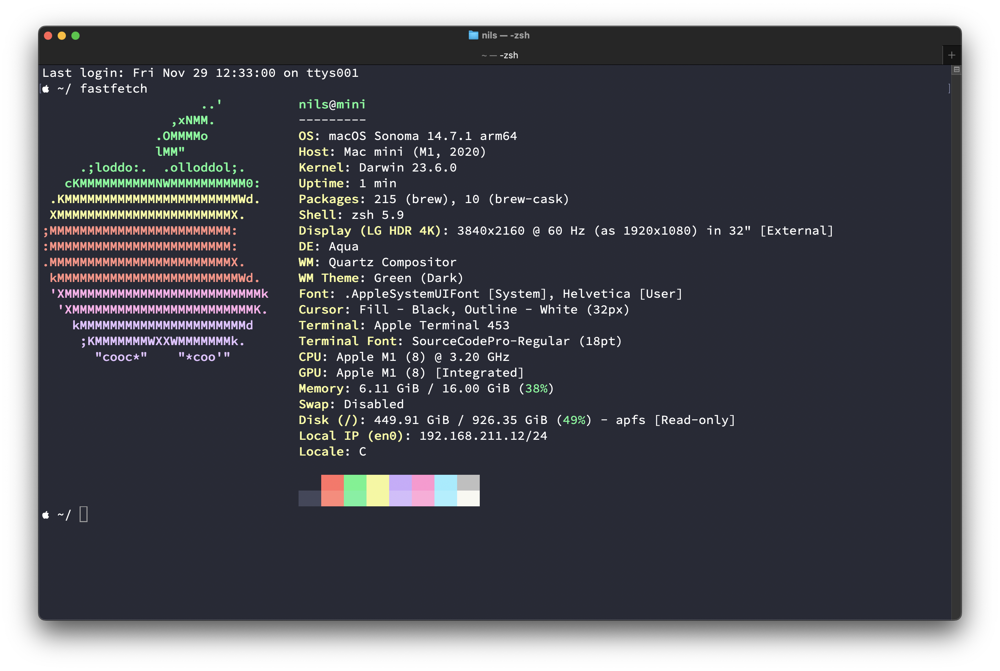

# macOS

My notes and scripts to quickly configure a new Mac.




## Full Disk Access

⚠️ Some command requires to grant full disk access to the `Terminal.app`.

Edit: System Preferences → Privacy & Security → Full Disk Access


## FileVault

Enable disk encrypting.


## SSH

The book [Practical Cryptography With Go](https://leanpub.com/gocrypto/read#leanpub-auto-chapter-5-digital-signatures) suggests that [ED25519](https://ed25519.cr.yp.to/) keys are more secure and performant than RSA keys.

You can create and configure an ED25519 key with the following command:

```
mkdir -p ~/.ssh
chmod 700 ~/.ssh
ssh-keygen -t ed25519
```

Add your SSH private key to the `ssh-agent` and store your passphrase in the keychain.

```shell
ssh-add --apple-use-keychain ~/.ssh/id_ed25519
```

Add to `~/.ssh/config`:

```text
# enable integration between Keychain and SSH Agent  
UseKeychain yes
AddKeysToAgent yes
```

## Homebrew

Website: <https://brew.sh/>

Install the missing package manager for macOS:

```shell
/bin/bash -c "$(curl -fsSL https://raw.githubusercontent.com/Homebrew/install/HEAD/install.sh)"
```

### Packages

```shell
brew install ghostty # 👻
brew install starship # https://starship.rs/
brew install coreutils
brew install curl wget
brew install htop btop
brew install eza # A maintained replacement for ls, https://eza.rocks/
brew install git git-lfs && git lfs install
brew install nano sqlite jq yq shellcheck flake8 cloc
brew tap hashicorp/tap
brew install hashicorp/tap/terraform
brew install hashicorp/tap/packer
brew install hashicorp/tap/vault
brew install terraform-docs tfsec tflint sentinel opa
brew install imagemagick jhead
brew install md5sha1sum
brew install kubernetes-cli k9s # kubectl, https://k9scli.io/
brew install podman podman-compose && brew install --cask podman-desktop
ln /opt/homebrew/bin/docker /opt/homebrew/bin/podman
brew install skopeo # CLI tool for various operations on container images and image repositories
brew install bruno # https://github.com/usebruno/bruno
brew install gh # https://cli.github.com/
brew install jesseduffield/lazygit/lazygit # https://github.com/jesseduffield/lazygit
brew install mtr telnet
brew install neofetch fastfetch figlet
brew install yt-dlp
brew install rclone # https://rclone.org/
brew install cmake
brew install thefuck # The Fuck https://github.com/nvbn/thefuck
# Perl
brew install perl
PERL_MM_OPT="INSTALL_BASE=$HOME/perl5" cpan local::lib
brew install cpanminus pkg-config
# Go
brew install golang golangci-lint
# PHP
brew install php composer
# Ruby
brew install ruby
# Java
brew install openjdk
# noTunes - prevent iTunes or Apple Music from launching
# https://github.com/tombonez/noTunes
# Add to "Open at Login"
brew install --cask notunes
# hex editor, https://hexfiend.com/, https://github.com/HexFiend/HexFiend
brew install --cask hex-fiend
# OmniDiskSweeper (Quickly find large, unwanted files)
# https://www.omnigroup.com/more
brew install --cask omnidisksweeper
# IINA open-source media player, https://iina.io/
brew install --cask iina
# Container scanner
# https://google.github.io/osv-scanner/
brew install osv-scanner
# https://github.com/anchore/grype
brew tap anchore/grype
brew install grype
```

#### Ansible

Install:
```bash
python3 -m pip install --user ansible
python3 -m pip install --user ansible-lint
```

Upgrade:
```bash
python3 -m pip install --upgrade --user ansible
python3 -m pip install --upgrade --user ansible-lint
```

#### More Packages

`gopls` (pronounced "Go please") the [Go language server](https://pkg.go.dev/golang.org/x/tools/gopls#section-readme):

```shell
go install golang.org/x/tools/gopls@latest
```


## Applications

### Firefox

Website: <https://www.mozilla.org/en-US/firefox/new/>

German Dictionary: <https://addons.mozilla.org/en-US/firefox/addon/dictionary-german/>

### Chrome

Website: <https://www.google.com/chrome/>

### Visual Studio Code

Website: <https://code.visualstudio.com/docs/setup/mac>

Download: <https://code.visualstudio.com/Download>

#### Launching from the command line

You can also run VS Code from the terminal by typing 'code' after adding it to the path:

1. Launch VS Code.
1. Open the Command Palette (<kbd>Cmd</kbd>+<kbd>Shift</kbd>+<kbd>P</kbd>) and type `shell command` to find the Shell Command: Install 'code' command in PATH command.

#### Setting

Open Settings (<kbd>Cmd</kbd>+<kbd>,</kbd>) and copy JSON settings: [vscode.json](vscode.json)

#### Extensions

Install extensions:
```shell
extensions=(
    "4ops.packer"
    "bierner.markdown-mermaid"
    "dracula-theme.theme-dracula"
    "EditorConfig.EditorConfig"
    "eeyore.yapf"
    "euskadi31.json-pretty-printer"
    "github.vscode-github-actions"
    "GitLab.gitlab-workflow"
    "golang.Go"
    "hashicorp.terraform"
    "mechatroner.rainbow-csv"
    "ms-azuretools.vscode-containers"
    "ms-python.debugpy"
    "ms-python.python"
    "ms-python.vscode-pylance"
    "ms-vscode-remote.vscode-remote-extensionpack"
    "redhat.ansible"
    "redhat.vscode-yaml"
    "samosad.tt"
    "vscode-icons"
    "ZainChen.json"
)

for extension_id in "${extensions[@]}"; do
    code --install-extension "$extension_id"
done
```

To install a extension you can also just execute the following command in the Command Palette of Visual Studio Code:

```text
ext install vscode-icons
```

###  XQuartz

Website: <https://www.xquartz.org/>

> The XQuartz project is an open-source effort to develop a version of the X.Org X Window System that runs on macOS.
> Together with supporting libraries and applications, it forms the X11.app that Apple shipped with OS X versions 10.5 through 10.7.

```shell
brew install --cask xquartz
```

Change settings:


Run container:

```bash
podman run \
    -v /tmp/.X11-unix:/tmp/.X11-unix \
    -v ~/.Xauthority:/tmp/.Xauthority \
    -e DISPLAY=[MAC-IP]:0 \
    -e XAUTHORITY=/tmp/.Xauthority \
    -e XDG_RUNTIME_DIR=/tmp/runtime-root \
    --name konsole konsole:test
```

Example: <https://github.com/Cyclenerd/toolbox/tree/master/xquartz#readme>

### Google Cloud CLI

Website: <https://cloud.google.com/sdk/docs/install>

```shell
brew install --cask gcloud-cli
```

### AWS CLI

Website: <https://docs.aws.amazon.com/cli/latest/userguide/getting-started-install.html>

```shell
brew install awscli
```

#### aws-azure-login

Website: <https://github.com/aws-azure-login/aws-azure-login>

```shell
sudo npm install -g aws-azure-login --unsafe-perm
```

Login:

```shell
aws configure
aws-azure-login --configure
aws-azure-login
aws sts get-caller-identit
```

### DBeaver (Universal Database Tool)

Website: <https://dbeaver.io/>

```shell
brew install --cask dbeaver-community
```

### DB Browser for SQLite

Website: <https://sqlitebrowser.org/dl/>

```shell
brew install --cask db-browser-for-sqlite
```

### XCode

Download: <https://itunes.apple.com/us/app/xcode/id497799835>

```bash
sudo xcode-select -s /Applications/Xcode.app/Contents/Developer
sudo xcodebuild -runFirstLaunch
sudo xcodebuild -license
xcodebuild -downloadPlatform iOS
open -a Simulator
```

### Android Studio

Download: <https://developer.android.com/studio>

Download and install also [`sdkmanager`](https://developer.android.com/tools/sdkmanager) via the Android SDK Command-Line Tools package:

1. Download the latest "command line tools only" package from the [Android Studio downloads page](https://developer.android.com/studio).
1. Unzip into Android SDK directory
    ```bash
    cd "$HOME/Library/Android/sdk"
    unzip ~/Downloads/commandlinetools-mac-10406996_latest.zip
    ```
1. Move the original `cmdline-tools` directory contents into the newly created `latest` directory:
    ```bash
    cd cmdline-tools
    mkdir -p latest
    mv "NOTICE.txt" "latest/"
    mv "bin" "latest/"
    mv "lib" "latest/"
    mv "source.properties" "latest/"
    ```

### Flutter

Download:
<https://docs.flutter.dev/get-started/install/macos>

Install:
```bash
cd "$HOME"
unzip ~/Downloads/flutter_macos_arm64_3.16.2-stable.zip
```

[CocoaPods](https://guides.cocoapods.org/using/getting-started.html#installation):
```bash
gem install cocoapods --user-install
gem which cocoapods
```

Test:

```bash
flutter doctor --android-licenses
flutter doctor
```

OK:
```text
Doctor summary (to see all details, run flutter doctor -v):
[✓] Flutter (Channel stable, 3.16.2, on macOS 13.6.1 22G313 darwin-arm64, locale en-US)
[✓] Android toolchain - develop for Android devices (Android SDK version 34.0.0)
[✓] Xcode - develop for iOS and macOS (Xcode 15.0.1)
[✓] Chrome - develop for the web
[✓] Android Studio (version 2023.1)
[✓] VS Code (version 1.84.2)
[✓] Connected device (2 available)
[✓] Network resources

• No issues found!
```

### FreeCAD

Website: <https://www.freecad.org/>

```bash
brew install --cask freecad
```

### Blender

Website: <https://www.blender.org/>

```bash
brew install --cask blender
```

### Manually

Watch out! Not all apps are optimized for the Apple Silicon CPU!


| Software | Apple Silicon |
|----------|---------------|
| [shottr (Screenshot tool)](https://shottr.cc/) | ✅ |
| [Adobe Acrobat Reader](https://www.adobe.com/acrobat/pdf-reader.html) | ✅ |
| [Audacity](https://www.audacityteam.org/download/mac/) | ✅ |
| [Balena Etcher](https://etcher.balena.io/#download-etcher) | ✅ |
| [Elgato Control Center](https://www.elgato.com/en/downloads) | ✅ |
| [Elgato Camera Hub](https://www.elgato.com/en/downloads) | ✅ |
| [Garmin Express](https://www.garmin.com/en-US/software/express/mac/) | ❌ |
| [Geekbench 6](https://www.geekbench.com/download/) | ✅ |
| [GoldenCheetah](http://www.goldencheetah.org/#section-download) | ❌ |
| [Google Earth Pro](https://www.google.com/earth/versions/#download-pro) | ❌ |
| [KeePassXC](https://keepassxc.org/download/#mac) | ✅ |
| [LibreOffice](https://www.libreoffice.org/download/download-libreoffice/) | ✅ |
| [Logi Options+](https://www.logitech.com/en-us/software/logi-options-plus.html) | ✅ |
| [Minecraft](https://www.minecraft.net/en-us/store/minecraft-java-bedrock-edition-pc) | ❌ |
| [OBS](https://obsproject.com/) | ✅ |
| [Poedit](https://poedit.net/download>) | ✅ |
| [Postman](https://www.postman.com/downloads/) | ✅ |
| [qFlipper](https://flipperzero.one/update) | ✅ |
| [QMK Toolbox](https://github.com/qmk/qmk_toolbox/releases/latest) | ✅ |
| [Raspberry Pi Imager](https://www.raspberrypi.com/software/) | ✅ |
| [Shotcut](https://www.shotcut.org/download/) | ✅ |
| [Sourcetree](https://www.sourcetreeapp.com/) | ✅ |
| [Spotify](https://www.spotify.com/de/download/mac/) | ✅ |
| <s>[Logitech G HUB](https://download01.logi.com/web/ftp/pub/techsupport/gaming/lghub_installer.zip)</s> | ❌ |

### App Store

* [Xcode](https://apps.apple.com/de/app/xcode/id497799835?l=en&mt=12)
    * FileMerge (opendiff) is bundled with Xcode. "Show Package Contents" of Xcode -> Contents -> Applications -> FileMerge.app
* [Commander One PRO](https://apps.apple.com/de/app/commander-one-pro-ftp-client/id1035237815?l=en&mt=12)
* [The Unarchiver](https://apps.apple.com/de/app/the-unarchiver/id425424353?l=en&mt=12)
* [Acorn7](https://apps.apple.com/de/app/acorn-7/id1547371478?l=en&mt=12)
* [dict.cc plus](https://apps.apple.com/de/app/dict-cc-dictionary/id521791825?l=en)

## Terminal

Import [`Dracula.terminal`](./Dracula.terminal) into Terminal Settings (<kbd>Cmd</kbd>+<kbd>,</kbd>)


Remap Keyboad shortcuts:

| Custom          | Default                         | Action                                                |
|-----------------|---------------------------------|-------------------------------------------------------|
| <kbd>Home</kbd> | <kbd>Control</kbd>+<kbd>A</kbd> | Move the insertion point to the beginning of the line |
| <kbd>End</kbd>  | <kbd>Control</kbd>+<kbd>E</kbd> | Move the insertion point to the beginning of the line |

More help: <https://support.apple.com/guide/terminal/keyboard-shortcuts-trmlshtcts/mac>

### Add Mapping


### Mapping


## Themes / Fonts

### Source Code Pro

Website: <https://adobe-fonts.github.io/source-code-pro/>

Download TTF: <https://fonts.google.com/download?family=Source%20Code%20Pro>

Install: `SourceCodePro-Medium.ttf`

Brew:

```bash
brew install --cask font-source-code-pro
```

### Roboto

Download TTF: <https://fonts.google.com/download?family=Roboto>

Install: `Roboto-Regular.ttf`

Brew:

```bash
brew install --cask font-roboto
```

### Dracula

* Terminal: <https://draculatheme.com/terminal>
    * Download: <https://github.com/dracula/terminal-app/archive/master.zip>
* Visual Studio Code:
    1. Go to View -> Command Palette or press <kbd>Cmd</kbd>+<kbd>Shift</kbd>+<kbd>P</kbd>
    1. Then enter Install Extension
    1. Write `Dracula Official`
    1. Select it or press <kbd>Enter</kbd> to install


## Hardware

### MOTU M2

Website: <https://motu.com/en-us/products/m-series/m2/getting-started/>

No extra drivers needed!

### EPSON WF-3820 Series

Website: <https://support.epson.net/setupnavi/?LG2=EN&OSC=MI&MKN=WF-3820&PINF=menu&linkflg=alllist>

Download: <https://download.ebz.epson.net/dsc/du/02/DriverDownloadInfo.do?LG2=EN&CN2=US&CTI=59&PRN=WF-3820%20Series&OSC=MI&DL>


## Hypervisor Virtualization

### Parallels Desktop

Download: <https://www.parallels.com/de/products/desktop/trial/>

### UTM Virtual Machines

Website: <https://mac.getutm.app/>

Link: <https://apps.apple.com/de/app/utm-virtual-machines/id1538878817?l=en&mt=12>

#### Images

* [Ubuntu](https://ubuntu.com/download/server/arm)
* [Rocky](https://rockylinux.org/download)


## Defaults

For most settings I have saved the macOS `defaults`.
You can find them in the [defaults](./defaults/) folder.

Run the scripts only after all programs, themes and fonts are installed.

## Keyboard Shortcuts

System Preferences > Keyboard > Shortcuts > App Shortucts, click on `+`, keep 'All applications', enter exact text into 'Menu Title' and assign shortcut in 'Keyboard Shortcut'.


* `Tile Window to Left of Screen` : <kbd>⌃</kbd> <kbd>⌥</kbd> <kbd>⌘</kbd> <kbd>L</kbd>
* `Tile Window to Right of Screen` : <kbd>⌃</kbd> <kbd>⌥</kbd> <kbd>⌘</kbd> <kbd>R</kbd>
* `Move Window to Left Side of Screen` : <kbd>⌃</kbd> <kbd>⌘</kbd> <kbd>L</kbd>
* `Move Window to Right Side of Screen` : <kbd>⌃</kbd> <kbd>⌘</kbd> <kbd>R</kbd>
* `Zoom` : <kbd>⌃</kbd> <kbd>⌘</kbd> <kbd>Z</kbd>
* `Move to Built-in Retina Display` : <kbd>⌃</kbd> <kbd>⌘</kbd> <kbd>B</kbd>
* `Move to LG HDR 4K` : <kbd>⌃</kbd> <kbd>⌘</kbd> <kbd>G</kbd>


Note:
There is also already a built-in keyboard shortcut to toggle full screen: <kbd>⌃</kbd> <kbd>⌘</kbd> <kbd>F</kbd>

Which key 🤔:

* <kbd>⌃</kbd> = <kbd>Ctrl</kbd>
* <kbd>⌥</kbd> = <kbd>Alt</kbd>
* <kbd>⌘</kbd> = <kbd>Win</kbd>

