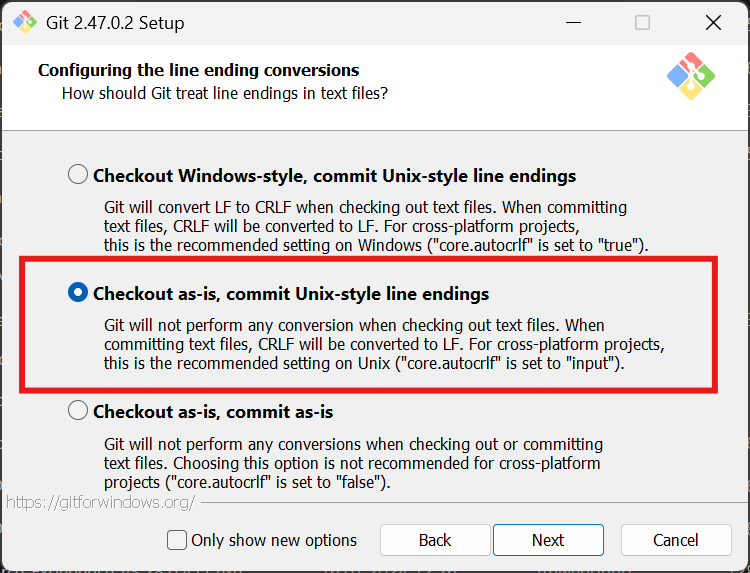

# Windows

Stuff that helps me when I use Windows...

* `w11_old_context_menus.reg` : Get the old context menus back in Windows 11

## ConEmu

Fast and reliable terminal window where you may host any console application developed either for WinAPI (cmd, powershell, far) or Unix PTY (cygwin, msys, wsl bash). 

Installation is easy. Just unpack or install to any folder and run `ConEmu.exe`.

About: <https://conemu.github.io/en/>

* `conemu.xml` : My ConEmu settings

Copy to `%APPDATA%/ConEmu.xml`.

## Windows Termianl

Modern, fast, efficient, powerful, and productive terminal application for users of command-line tools and shells like Command Prompt, PowerShell, and WSL.

About: <https://aka.ms/terminal>

* `terminal.json` : My Windows Terminal settings

## Git for Windows

Download and install [Git for Windows](https://github.com/git-for-windows/git/releases/latest).

Please pay attention to the configuration during installation. Enable "Checkout as-is, commit Unix-style line endings".

## TortoiseGit

TortoiseGit is a Windows Shell Interface to Git and based on TortoiseSVN.
It's open source and can fully be build with freely available software.
TortoiseGit provides overlay icons showing the file status, a powerful context menu for Git and much more!

About: <https://tortoisegit.org/about/>